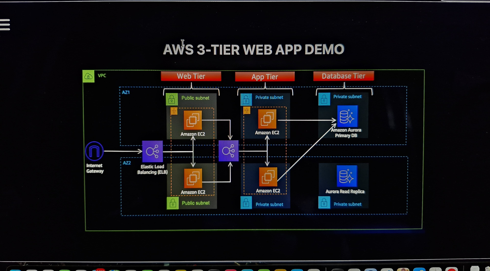
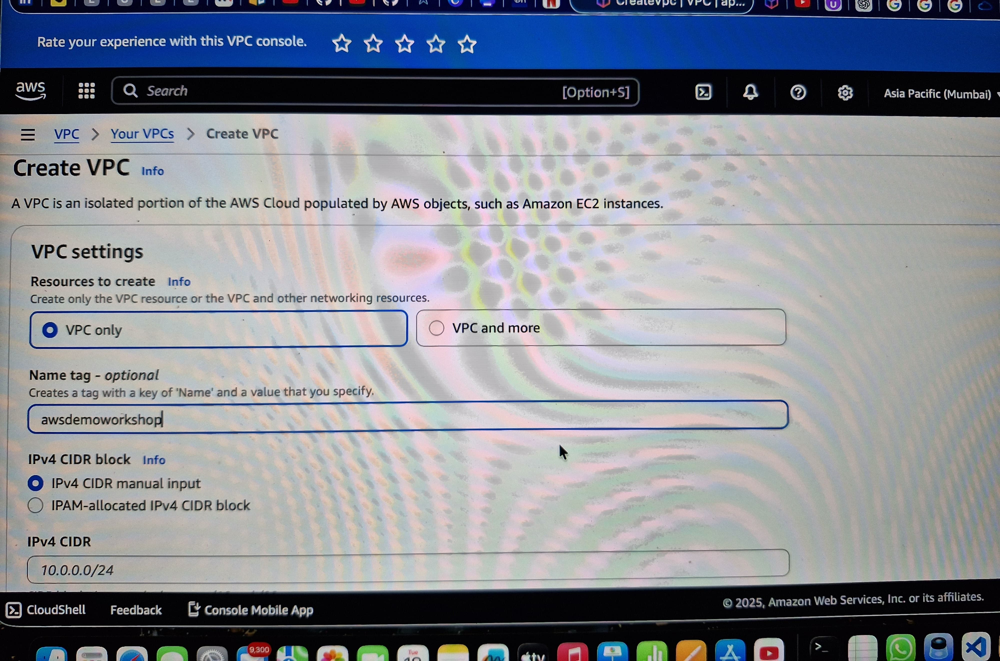
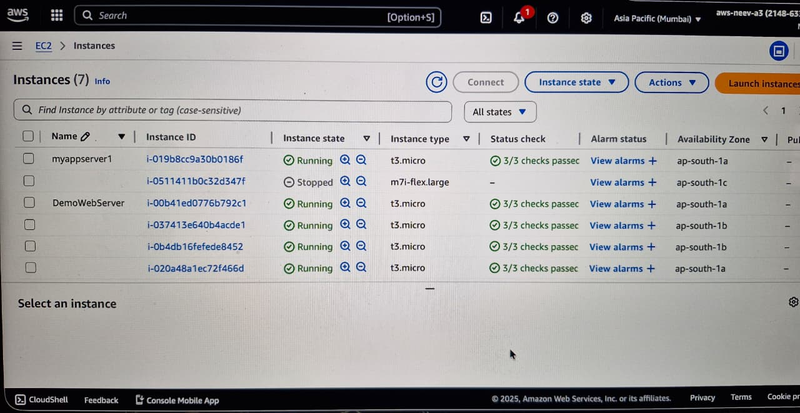
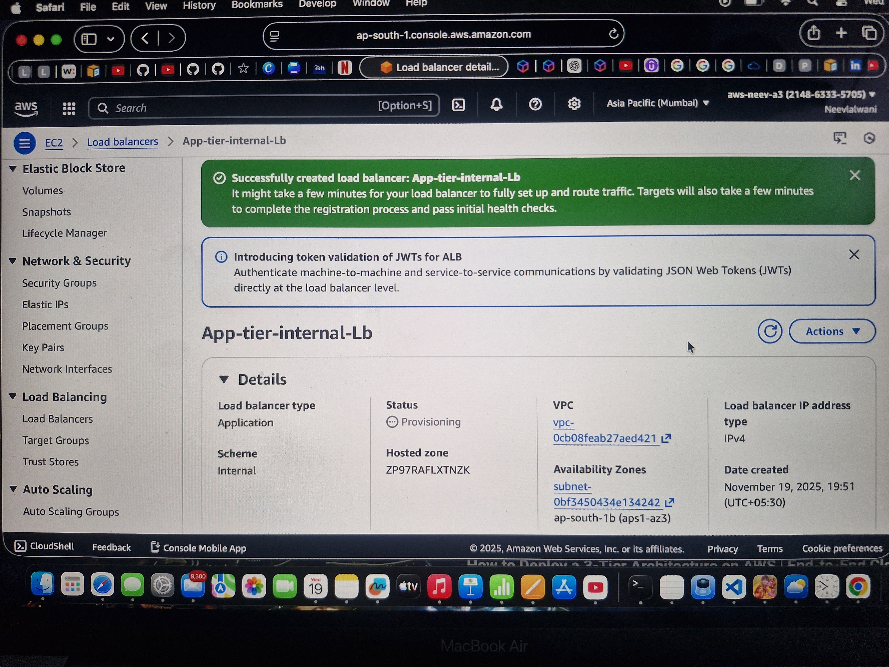
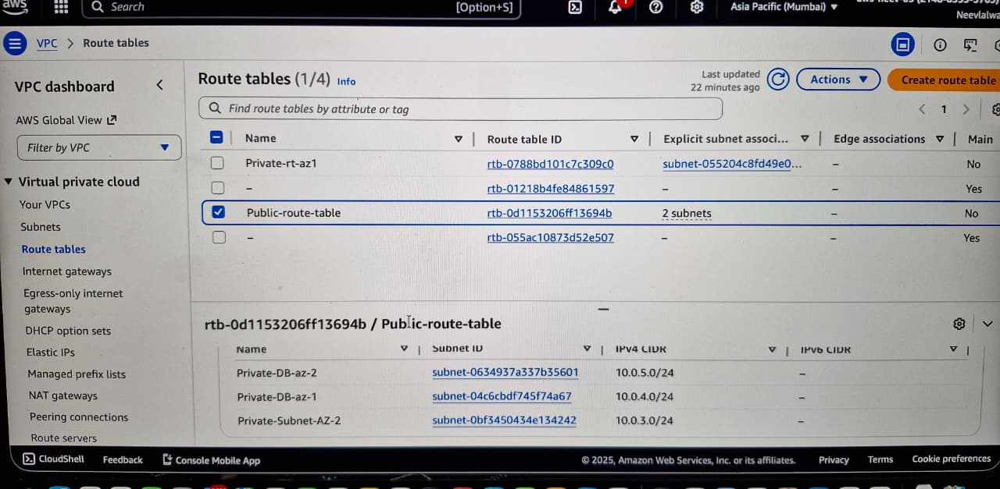
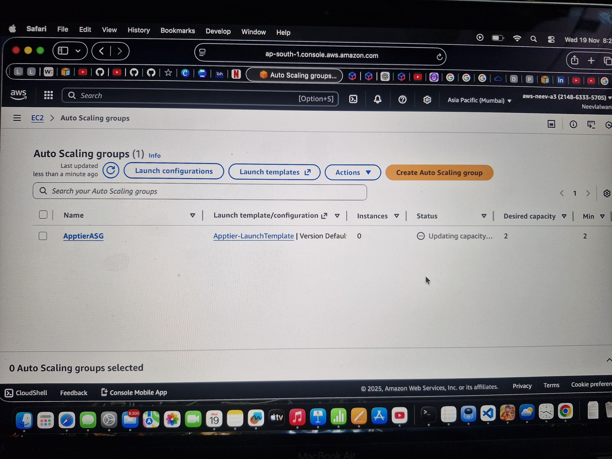
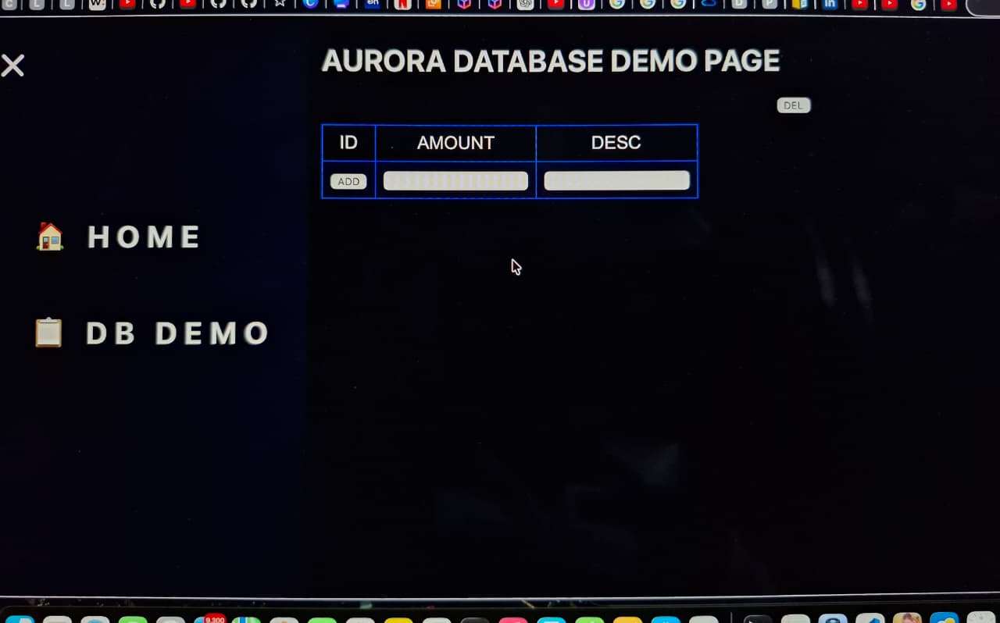

# three-tier-aws-project
## 🏗️ AWS 3-Tier Architecture

# 🌐 AWS 3-Tier Web Application Architecture

This project uses a classic **three-tier architecture** with:

- **Web Tier (Public Subnets)** – EC2 instances handling front-end
- **App Tier (Private Subnets)** – EC2 instances running backend services
- **Database Tier (Private Subnets)** – Amazon Aurora Primary + Read Replica
- **Elastic Load Balancer**
- **Auto Scaling across 2 AZs**
- **Secure VPC with IGW, Nat Gateway, Route Tables, and Security Groups**

# 🌐 AWS 3-Tier Application VPC

  

# 🌐 AWS 3-Tier Application Servers 

  

# 🌐 AWS InternetGateway

  

# 🌐 AWS LoadBalancers

  
  
  

# 🌐 AWS RouteTables

  

# 🌐 AWS AutoScalingGroup(ASG)

  
  
  

# 🌐 AWS Aurora Database

  
  

